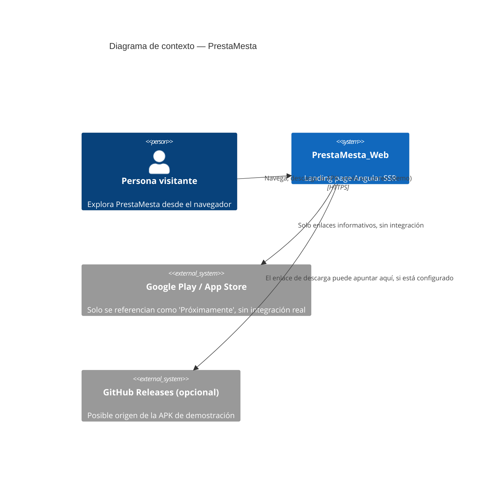
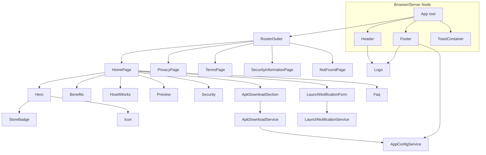
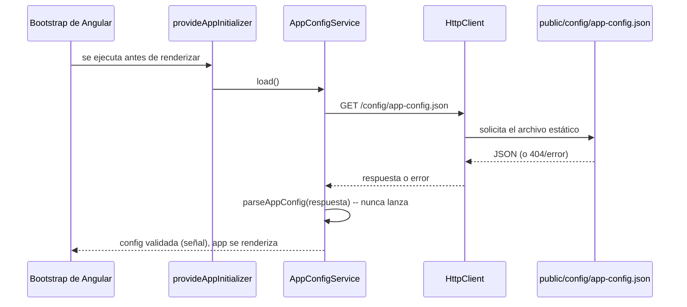
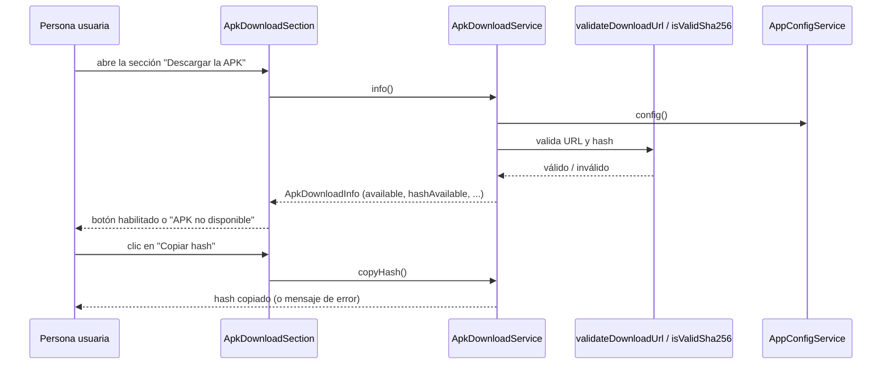
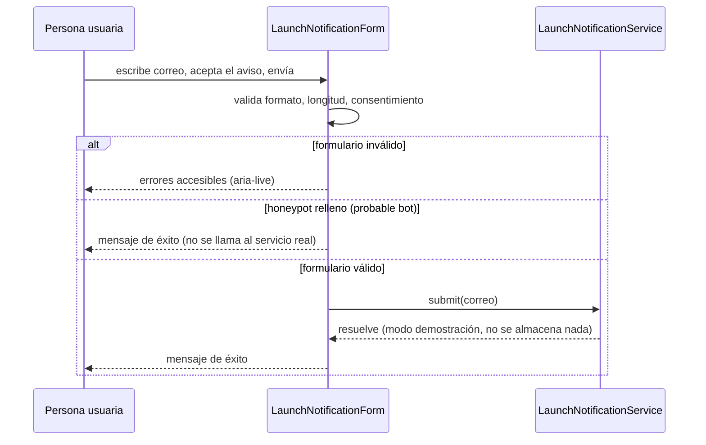
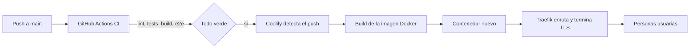

# Arquitectura — PrestaMesta_Web

## Contexto del sistema

PrestaMesta_Web es la landing page de un proyecto académico y demostrativo: una futura aplicación
móvil de préstamos personales. Esta landing page no procesa solicitudes de crédito ni pagos; su
propósito es presentar el producto, explicar cómo funcionaría, ofrecer una APK de demostración
descargable de forma segura y verificable, y captar interesados mediante un formulario que opera
en modo de demostración.



## Objetivos

- Presentar PrestaMesta de forma profesional, honesta y sin promesas financieras engañosas.
- Ofrecer una descarga de APK verificable (hash SHA-256) y segura (validación de URL/protocolo).
- Explicar, con transparencia, qué controles de seguridad están implementados hoy, cuáles se
  proponen para la app móvil futura, y cuáles dependerían de un backend que aún no existe.
- Cumplir un nivel razonable de accesibilidad (WCAG 2.2 AA) y de rendimiento.

## Requisitos funcionales (resumen)

- Navegación con menú accesible (escritorio y móvil).
- Secciones de contenido: hero, beneficios, cómo funciona, vista previa de la app, seguridad,
  descarga de APK, formulario de novedades, preguntas frecuentes.
- Páginas: inicio, aviso de privacidad, términos de uso, seguridad (detalle), 404.
- Descarga de APK condicionada a una configuración pública válida.
- Formulario de novedades en modo de demostración.

## Requisitos no funcionales (resumen)

- Seguridad: CSP estricta, cabeceras de seguridad, sin secretos en el frontend, saneamiento nativo
  de Angular sin excepciones inseguras.
- Accesibilidad: navegación por teclado, foco visible, `aria-live` en resultados dinámicos,
  contraste AA.
- Rendimiento: presupuestos de bundle en `angular.json`, prerenderizado de rutas estáticas.
- Mantenibilidad: arquitectura por características, funciones puras para validación.

## Stack tecnológico

Ver ADR [001](decisions/001-angular-framework.md): Angular 22, TypeScript estricto, componentes
standalone, Signals, Reactive Forms, Angular Router, `@angular/ssr`, Tailwind CSS v4, Vitest,
Playwright, Express (servidor SSR), Docker.

## Organización de módulos (carpetas)

```text
src/app/
  core/       # config, servicios transversales (SEO, toasts, consentimiento de analítica)
  shared/     # componentes/directivas/validadores reutilizables sin lógica de dominio propia
  layout/     # header, footer
  features/   # una carpeta por característica de negocio (home, apk-download, launch-notification,
              # privacy, terms, security-information, not-found)
```

Cada `feature` agrupa sus propias páginas, componentes, servicios, modelos y validadores. `shared`
no depende de ninguna `feature`; las `features` pueden depender de `core` y `shared`, pero no unas
de otras salvo mediante modelos explícitamente compartidos (por ejemplo,
`security-information/models/security-principle.model.ts`, reutilizado por la sección de
seguridad del home).



## Flujo de datos

### Carga de configuración pública



### Descarga de la APK



### Formulario de novedades



### Despliegue



## Gestión de estado

El estado es local a cada componente/servicio mediante Angular Signals. No existe una librería de
gestión de estado global: la única fuente de estado compartido entre componentes es
`AppConfigService` (config pública, cargada una vez) y `ToastService` (cola de notificaciones).

## Configuración en tiempo de ejecución

Ver ADR [006](decisions/006-public-runtime-configuration.md).

## Estrategia de renderizado

Ver ADR [004](decisions/004-rendering-strategy.md).

## Estrategia de despliegue

Ver ADR [008](decisions/008-deployment-platform.md) y `docs/deployment-coolify.md`.

## Escalabilidad

Esta landing page no tiene requisitos de escalabilidad complejos: es contenido mayormente estático
detrás de un proxy. Escalar horizontalmente el contenedor (varias réplicas detrás de Traefik) es
posible sin cambios de código, ya que el servidor Express no mantiene estado en memoria entre
peticiones.

## Mantenibilidad

- Funciones puras para toda lógica de validación (URL, hash, correo, configuración), fáciles de
  probar sin `TestBed`.
- Componentes pequeños con una sola responsabilidad (ver `docs/testing.md` para el detalle de
  cobertura).
- Modelos explícitos (`AppPublicConfig`, `ApkDownloadInfo`, `SecurityPrinciple`) en vez de tipos
  implícitos u `any`.

## Rendimiento

Ver presupuestos en `angular.json` (`budgets` de la configuración `production`) y la sección
correspondiente en `docs/deployment.md`.

## Accesibilidad

Ver `docs/accessibility.md`.

## Límites del sistema

- No hay autenticación ni sesiones.
- No hay procesamiento de pagos ni de solicitudes de crédito reales.
- No hay base de datos.
- El formulario de novedades no almacena ni transmite datos (modo de demostración).

## Decisiones y compromisos

Ver `docs/decisions/`. El compromiso más relevante desde el punto de vista de seguridad/UX es el
documentado en `docs/security.md` sobre `withEventReplay()` de Angular: se optó por mantener una
CSP estricta en lugar de habilitar esa característica, a costa de una ventana breve (típicamente
sub-segundo) en la que una interacción extremadamente rápida durante la hidratación podría
perderse.
