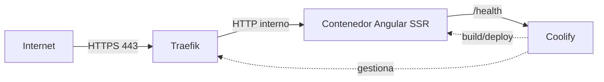

# Despliegue en producción — DigitalOcean + Coolify + Traefik + Docker

Esta es la guía de despliegue **principal** para PrestaMesta_Web (ver ADR
[008](decisions/008-deployment-platform.md)). Para alternativas breves (Nginx, hosting estático),
ver `docs/deployment.md`.

## Arquitectura de despliegue



- **Traefik** (gestionado por Coolify) es el único punto expuesto públicamente. Termina TLS,
  gestiona certificados Let's Encrypt, y enruta por dominio hacia el contenedor correcto.
- El **contenedor de la aplicación** nunca se expone directamente a internet: solo escucha en la
  red interna que Coolify/Traefik gestionan.
- **Coolify** hace el build de la imagen a partir del `Dockerfile` del repositorio en cada push (o
  manualmente), y gestiona el ciclo de vida del contenedor (despliegue, redeploy, rollback).

## 1. Droplet de DigitalOcean

### Requisitos del droplet

- Tamaño mínimo recomendado para Coolify + esta aplicación: 2 GB de RAM / 1 vCPU (Coolify por sí
  solo ya usa una parte no trivial de memoria; para producción real se recomienda 4 GB).
  Actualiza el requisito Real según el uso observado.
- Ubuntu LTS (la distribución oficialmente soportada por el instalador de Coolify).
- Almacenamiento: 25 GB o más (imágenes Docker, logs, certificados).

### DNS

Crea un registro `A` (y `AAAA` si usas IPv6) apuntando el dominio o subdominio elegido (por
ejemplo, `app.tudominio.com`) a la IP pública del droplet. Coolify/Traefik se encargan de emitir el
certificado Let's Encrypt una vez que el DNS resuelve correctamente.

### Autenticación SSH

- Genera un par de llaves SSH dedicado para administrar el droplet; **no** uses autenticación por
  contraseña.
- Deshabilita el login por contraseña en `/etc/ssh/sshd_config` (`PasswordAuthentication no`) una
  vez confirmado que el acceso por llave funciona.
- Restringe el acceso SSH a las IPs que realmente lo necesiten mediante el firewall de
  DigitalOcean (ver abajo), no solo mediante configuración del propio SSH.

### Firewall de DigitalOcean (Cloud Firewall)

Reglas de entrada mínimas:

| Puerto | Protocolo | Origen                                    | Propósito                            |
| ------ | --------- | ----------------------------------------- | ------------------------------------ |
| 22     | TCP       | Solo IPs/rangos administrativos conocidos | SSH                                  |
| 80     | TCP       | Cualquiera (`0.0.0.0/0`)                  | HTTP → redirección a HTTPS (Traefik) |
| 443    | TCP       | Cualquiera (`0.0.0.0/0`)                  | HTTPS (Traefik)                      |

- **No** abras el puerto en el que escucha el contenedor de la aplicación (`PORT`, por defecto 4000) al público: Traefik le llega por la red interna de Docker, no por el firewall externo.
- El panel de Coolify (usualmente en un puerto propio) debería restringirse a IPs administrativas
  conocidas, igual que SSH.

### Backups y actualizaciones

- Backups: usa los snapshots/backups automáticos de DigitalOcean para el droplet completo, y
  respalda por separado cualquier volumen de datos persistente que Coolify use (esta aplicación no
  tiene base de datos propia).
- Actualizaciones del sistema operativo y de Coolify son responsabilidad de quien administra el
  droplet — no las gestiona este repositorio ni el pipeline de CI.

## 2. Configuración en Coolify

1. **Conexión del repositorio**: conecta el repositorio Git (GitHub/GitLab/Bitbucket, según lo que
   soporte tu instancia de Coolify) a un nuevo recurso de tipo aplicación.
2. **Build pack**: selecciona **Dockerfile** (no Nixpacks ni buildpacks automáticos) — el
   repositorio ya incluye un `Dockerfile` multi-etapa optimizado para producción.
3. **Puerto del contenedor**: `4000` (coincide con `ENV PORT=4000` y `EXPOSE 4000` del
   `Dockerfile`). Si se cambia `PORT` mediante una variable de entorno de Coolify, actualiza este
   valor también en la configuración del recurso.
4. **Dominio**: configura el dominio/subdominio apuntado por DNS (ver arriba). Coolify emite el
   certificado Let's Encrypt automáticamente a través de Traefik una vez que el DNS resuelve.
5. **HTTPS**: se gestiona íntegramente por Traefik/Coolify. La aplicación no necesita (ni debe)
   terminar TLS por sí misma.
6. **Ruta de health check**: `/health`. Configúrala en la sección de Health Checks del recurso en
   Coolify para que el tráfico nuevo no se enrute a un contenedor que todavía no está listo. La
   respuesta es intencionalmente mínima (`{"status":"ok"}`) y no expone versiones de dependencias,
   variables de entorno, ni rutas del sistema de archivos.
7. **Variables de entorno en tiempo de ejecución**: define aquí cualquier variable que el
   contenedor necesite (por ejemplo, `PORT` si se quiere cambiar del valor por defecto). **Nunca**
   coloques secretos que deban llegar al navegador — nada de lo que consume el frontend Angular
   debería ser sensible en primer lugar (ver ADR
   [006](decisions/006-public-runtime-configuration.md)). Si en el futuro se activa el servidor de
   referencia (`server/`, ver ADR [007](decisions/007-form-backend.md)) como un recurso aparte,
   sus variables (ver `.env.example`) se marcan como _runtime-only_ en Coolify, nunca como
   argumentos de build.
8. **Redespliegue y rollback**: cada push a la rama configurada dispara un nuevo build y
   despliegue. Coolify conserva las imágenes de builds anteriores, permitiendo volver a una versión
   previa desde su interfaz si el nuevo despliegue falla el health check o presenta problemas.
9. **Límites de recursos**: configura límites de CPU/memoria para el contenedor en Coolify acordes
   al tamaño del droplet, dejando margen para el propio Coolify/Traefik y para otros servicios que
   puedan compartir el mismo droplet.

## 3. Cabeceras de seguridad: quién es dueño de qué

Ver la tabla completa en `docs/security.md`. Resumen:

- La **aplicación** (Express, `src/server.ts`) define: `Content-Security-Policy`,
  `X-Content-Type-Options`, `X-Frame-Options`, `Referrer-Policy`, `Permissions-Policy`,
  `Cross-Origin-Opener-Policy`, `Cross-Origin-Resource-Policy`.
- **Traefik** define `Strict-Transport-Security` — solo tiene sentido una vez que HTTPS está
  correctamente configurado extremo a extremo, y así se evita definirla dos veces con valores que
  podrían desincronizarse.

Si se necesita ajustar cabeceras a nivel de Traefik (por ejemplo, para añadir HSTS), Coolify
permite definir _middlewares_ de Traefik por aplicación. Ejemplo (para adaptar en la configuración
de Coolify, no un archivo de este repositorio):

```yaml
# Middleware de Traefik gestionado desde Coolify — solo HSTS, todo lo demás lo define la app.
http:
  middlewares:
    prestamesta-hsts:
      headers:
        stsSeconds: 63072000
        stsIncludeSubdomains: true
        stsPreload: false # actívalo solo tras confirmar que todos los subdominios usan HTTPS
```

No dupliques aquí la Content-Security-Policy ni el resto de cabeceras que ya define la aplicación.

## 4. Caché

- **Activos con hash en el nombre de archivo** (JS/CSS generados por el build de producción,
  `outputHashing: all`): cachear agresivamente (`Cache-Control: public, max-age=31536000,
immutable`). `express.static` ya se configura con `maxAge: '1y'` en `src/server.ts`.
- **HTML, `/health`, y `public/config/app-config.json`**: **no** cachear agresivamente. El HTML de
  las rutas prerenderizadas puede cambiar en cada despliegue; `/health` debe reflejar el estado
  actual del contenedor; `app-config.json` es precisamente el mecanismo para cambiar valores (URL
  de la APK, hash, etc.) sin reconstruir la imagen — cachearlo de forma agresiva anularía ese
  propósito.

## 5. Verificar el despliegue

Tras el primer despliegue, valida desde una máquina externa:

```bash
curl -I https://tu-dominio.example.com/
curl -s https://tu-dominio.example.com/health
```

Confirma que aparecen las cabeceras documentadas en `docs/security.md` (incluyendo
`Strict-Transport-Security`, que solo debería verse a través de HTTPS, nunca en HTTP).

## 6. `allowedHosts` de Angular

`angular.json` define `build.options.security.allowedHosts`. Angular valida la cabecera `Host` de
cada petición contra esta lista antes de renderizar, como protección contra ataques de tipo Host
header / SSRF. Este repositorio la deja en `["*"]` porque:

- No existe todavía un dominio de producción real que fijar en el repositorio.
- El contenedor nunca recibe tráfico directamente de internet: Traefik es quien enruta por dominio
  antes de reenviar la petición al contenedor, por lo que la validación real del `Host` público ya
  ocurre en esa capa.

**Antes de un lanzamiento real**, reemplaza `["*"]` por el dominio (o dominios) exactos configurados
en Coolify (por ejemplo, `["app.tudominio.com"]`) y reconstruye la imagen. Esto añade una capa
adicional de defensa en profundidad además de Traefik.
